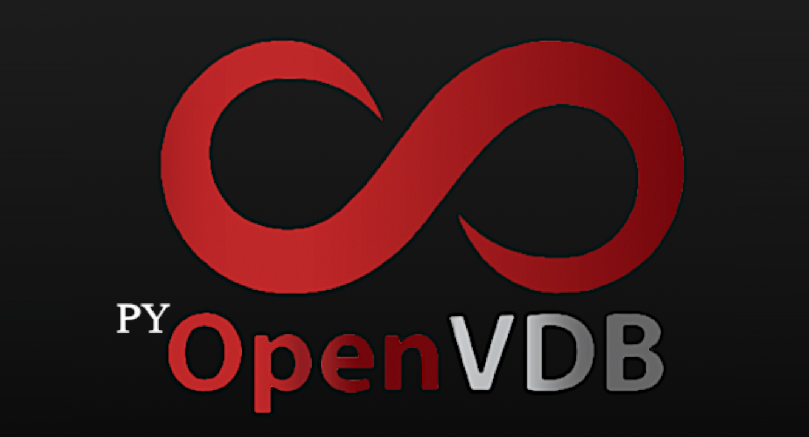

    
    
    
    
    

<!--  -->

# pyopenvdb
OpenVDB for python 3.7
Creates a docker container, which is used to build and package pyopenvdb.
pyopenvdb.dockerfile is for development.
prod_pyopenvdb.dockerfile is for testing installation of pyopenvdb pip package.

# Installation
### Currently only for linux systems with x86_64 architecture
1. pip install pyopenvdb
2. Find parent directory of pyopenvdb.so with `find / | grep -P 'pyopenvdb\.so'`
3. `export LD_LIBRARY_PATH=`[parent directory]
4. Add `import numpy` and `import openvdb` to ipykernel_launcher.py to get
   jupyter lab to import without a pointer error.

# Dev Installation
Unless you intend on building and packing OpenVDB python bindings, you do not
need to follow these instructions.
1. Install [docker](https://docs.docker.com/v17.09/engine/installation)
2. Install [docker-machine](https://docs.docker.com/machine/install-machine) (if running on macOS or Windows)
3. Ensure docker-machine has at least 4 GB of memory allocated to it.
4. `git clone git@github.com:theNewFlesh/pyopenvdb.git`
5. `cd pyopenvdb`
6. `chmod +x bin/pyopenvdb`
7. `bin/pyopenvdb start`

The service should take several minutes to start up.

Run `bin/pyopenvdb --help` for more help on the command line tool.

# Usage
`>>>python3.7`

`>>>import openvdb`
